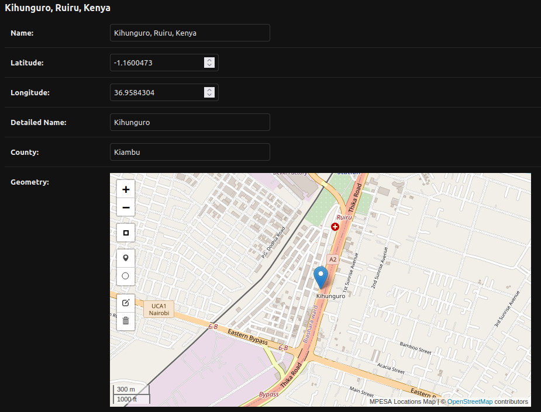

:toc:

= Mpesa Locator Backend

== Project Overview

Mpesa Locator is a simplified tool for backend engineers and project managers especially those working with location-based data. It consists of an application programming interface (API) endpoints supporting user authorization and authentication, and management of link:https://en.wikipedia.org/wiki/Geographic_information_system[geographic information systems] (GIS) data for MPESA locations in selected locations in selected counties in Kenya. The location properties of the data used in this project have been sourced from link:https://developers.google.com/maps/documentation/geolocation/overview[Google Geolocation API].

=== Structure Overview
This project is split into two parts – the back end (written in Python &amp;
Django), and the front-end (written in JavaScript &amp; React) and exists in another repository.

The general folder structure for the project can be seen below:

----
├── data                   # Contains GIS dataset and importing script
├── db-init-script         # Contains database entry point script with instructions
├── locator-api            # Locator app with REST API endpoints for data
├── locator_backend        # Django project folder with project files
├── people                 # Django app facilitating user account management
├── .dockerignore          # Includes files/folders to be excluded from image building
├── .editorconfig          # Configuration defining consistent coding styles and formatting
├── .env_local             # Includes environment variables for the local environment
├── .gitignore             # Includes files/folders to be excluded from git commits
├── Dockerfile.dev         # Instructions specifying how to build docker images.
├── LICENSE                # License for this project
├── Makefile               # List of utility commands to help developers
├── Pipfile                # Configuration for virtual environments, and dependencies for Python
├── Pipfile.lock           # Includes versions of the dependencies and transitive dependencies
├── README.md              # Readme file for this project
├── docker-compose.dev.yml # Configuration defining multiple Docker containers used in this app
├── manage.py              # Command-line interface for performing administrative tasks
├── pytest.ini             # Configuration file for unit testing using pytest framework
----
To perform some operations, a link:Makefile[Makefile] with a set of `make`
commands is provided. In order to run these commands, the GNU `make` utility
needs to be installed. Some of the commands are listed below.

TIP:  To see exactly what a make command is doing, you can run it with the `-n` argument. +
 `make migrate -n` will output some details
 This that you can see how to run arbitrary Django commands.

==== System Prerequisites
To be able to run the project in a Docker environment, it's necessary to have
https://docs.docker.com/[`docker`] and
https://docs.docker.com/compose/[`docker-compose`] installed.

TIP:  Please refer to
https://docs.docker.com/install/[Docker installation docs] and +
https://docs.docker.com/compose/install/[Docker Compose
installation docs] to install them.

=== Software
This back-end project consists of two services, one with _Python 3.10_ and _Django 4.2_, and the second one, _PostGIS_ based on _PostgreSQL 15_ database.

All Python package requirements are listed in
link:Pipfile[`Pipfile`]. The initial requirements include:

* https://docs.djangoproject.com/en/4.2/[Django] as the base framework
* https://www.django-rest-framework.org/[djangorestframework]
 for REST API
* https://github.com/openwisp/django-rest-framework-gis/[djangorestframework-gis]
 for adding geographic functionalities to Django REST framework
* https://www.psycopg.org/psycopg3/docs/[psycopg] Python database adapter for PostgreSQL databases
* https://www.psycopg.org/psycopg3/docs/[psycopg-binary] convenience package that provides precompiled binary wheels for psycopg
* https://dj-rest-auth.readthedocs.io/en/latest/[dj-rest-auth] for basic auth functionality like login, logout, and signup which can be extended
* https://django-allauth.readthedocs.io/en/latest/[django-allauth] to
 help with the standard user registration process
* https://django-allauth.readthedocs.io/en/latest/[django-leaflet] for adding leaflet addons to Django
* https://github.com/adamchainz/django-cors-headers/[django-cors-headers] for handling the server headers required for Cross-Origin Resource Sharing (CORS)
* https://github.com/jazzband/dj-database-url/[dj-database-url] for configuring database URLs
* https://django-environ.readthedocs.org/[django-environ] for management of environment variables

All third-party packages are listed in the link:Pipfile[Pipfile] including the ones not listed here.

=== QuickStart
As a first mandatory step, rename the link:.env_local[.env_local] to **.env** and add the necessary values to each environment variable.

To build and setup the application from the ground up, ignoring previously build cached layers, just type:

[source,bash]
----
make build-with-no-cache
----

You can also build with the usual build command by typing:
[source,bash]
----
make build
----

This will create the necessary Docker containers and install the required
Python packages.

To start the services while seeing the log, type:

[source,bash]
----
make start-django
----
Alternatively, to start the services in the background (detached mode) where you will not see the logs in the terminal, type:
[source,bash]
----
make start-django-detached
----
Once the services have started, Django should be running in its standard port 8000 and Postgres at 5432. You can change these values in the .env file and link:docker-compose.dev.yml[docker-compose] file.

To stop the services, type:
[source,bash]
----
make stop-django
----

Alternatively, to stop services and remove volumes that contain persisted data, type:
[source,bash]
----
make delete-django-volumes
----

To print out the logs, type:
[source,bash]
----
make print-logs
----

Alternatively, to print out logs interactively showing what is happening in the services, type:
[source,bash]
----
make print-logs-interactive
----

The other commands include:

* `make makemigrations` which creates new database migration files based on the changes you make to your models, if any.
* `make shell` which starts a Linux shell (bash) in the Django container
* `make django-shell` which starts a django python shell in the Django container

==== Database

To start the database will be empty.

To manually migrate the database, run:

----
make migrate
----

===== Application data

At the start, the project has no data in the database. No users, or data.

.To create a superuser:
----
make create-superuser
----

.To load initial data for projects which adds a default admin user:
----
make create-test-admin
----
The superuser created above has the following login credentials that you can use to access the Django admin site at http://127.0.0.1:8000/geoadmin/. Username: *geoadmin@email.com*, and password: *GeodjangoUser123@*

.To load location data for this project:
----
make load-gis-data
----
If you log into the administration site you will the prepopulated data listed under locator_api app.

=== Linting

https://github.com/psf/black[Black] is used to automatically format and lint
files. The `make lint-check` command checks that the project is correctly
formatted.

You can set up your editor to automatically format Python files using Black
following the instructions https://github.com/psf/black#editor-integration[on Black's GitHub
page].

You can also use the `make lint-fix` command to automatically format all
Python files in the project.

=== Testing

https://github.com/psf/black[pytest-django] is used to run automatic tests. The `make test-django` runs the unit tests on the apps in the project. Unit tests have been written for link:people/tests.py[people] and link:locator_api/tests.py[locator api] apps.

You can create additional tests on these files and also add coverage tests using link:https://pytest-cov.readthedocs.io/en/latest/[pytest-cov] or other test tools.

=== REST API

This project makes use of the link:https://www.django-rest-framework.org/[Django REST framework] for user account management and serving location data.

==== API Documentation

To access the API documentation, visit:

* **api/v1/schema/redoc/** for link:https://redocly.github.io/redoc/[Redoc]
* **api/v1/schema/swagger-ui/** for link:https://swagger.io/[Swagger]

===== Endpoints

The project REST API facilitates user management and serves data as JSON objects which can be consumed by any client. The following are the general endpoints. All other endpoints can be viewed in the documentation links above.
For people, app (user management) the following endpoints should work:

* **Signup** - api/v1/user-auth/signup/
* **Login** - api/v1/user-auth/login/
* **Logout** - api/v1/user-auth/logout/

And for the locator_api:

* **MPESA Locations** - api/v1/mpesa-locations/
